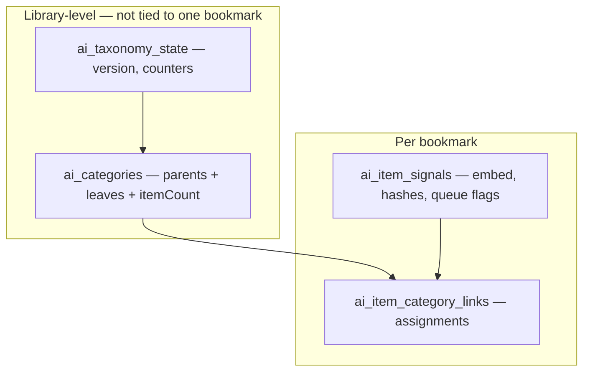

# TASK-02 — App implementation plan (CLI V1.2 → IndexedDB)

**Status:** implemented (2026-05-25) — app wire-up v1 shipped (topic-extract, seed, queues, dev UI); retained as design/history companion to Task 02 return  
**Depends on:** CLI validated (`topic-extract`, seed taxonomy, `discover-taxonomy`) — see `TASK-02-ai-categorization-v1.md`  
**Out of scope here:** CLI tuning, product accept/reject UX polish, taxonomy DAG (`parentIds[]`)

---

## Goal

Wire the **app** to the same behavior as CLI V1.2:

1. **Taxonomy** stored in DB (not only experiment JSON).
2. **Topic-extract** LLM classify (few-shot, full catalog, multi-label).
3. **Incremental** by default at scale: only new/changed items; discover in batches of N.

CLI remains the lab; this doc is **app storage + jobs + state** only.

---

## Two layers of data



| Layer | What | Examples |
|-------|------|----------|
| **Library** | Taxonomy + global run config | Categories, taxonomy version, “discover when ≥ N pending” |
| **Per item** | Signals + links | Embedding, classify hash, pending/done flags, primary/secondary categories |

**Not mixed:** projects/collections stay manual workflow containers. AI categories are a **separate semantic layer** (already decided in backlog).

---

## What to persist (mapping from CLI)

### Taxonomy hierarchy (parents + leaves)

Same shape as seed JSON (`parents[]` + `leaves[]` with `parentId`):

```text
parent (quant-finance)              ← not assignable; rollup counts
  ├── leaf (algo-trading-…)         ← specific topics
  ├── leaf (trading-strategies-…)
  └── leaf (quant-finance-general)  ← fallback when in-domain, no sibling fits
```

**Depth:** exactly **2 levels** (no grandparents). Child assignment **implies** parent for browse/counts — do not store a separate parent link when a specific leaf exists under that parent.

**One store, two node kinds** — extend **`ai_categories`**:

| Field | Parent | Leaf |
|-------|--------|------|
| `kind` | `'parent'` | `'leaf'` |
| `id`, `name`, `description` | ✓ | ✓ |
| `parentId` | — (null) | required → parent `id` |
| `assignable` | `false` | `true` (default) |
| `canonicalTags`, `centroid` | omit | optional |
| `status`, `source` | `approved` / `seed` typical | `ai_proposed` \| `approved` \| … |

- **LLM classify** uses **leaves only** (full catalog = all rows where `kind === 'leaf'`).
- **Parents** never appear in `ai_item_category_links.categoryId`.
- **Discover** may propose new leaves under an existing parent id (same as CLI).

**LLM catalog (classify + discover):** grouped by parent; each leaf has `path`, `pathIds: [parentId, leafId]`, `isGeneralFallback` on `*-general` leaves. Disambiguates similar names across branches.

**What the model returns (topic-extract):**

| Output field | Values | Stored as |
|--------------|--------|-----------|
| `topicIds` / `topicPaths` | **0–3 leaves** (`topicPaths` optional `[parentId, leafId]`) | links → **leaf id** only |
| `skip` | true | no links |
| `proposed[]` | new **specific** leaf draft + `parentId` | promote before assign |

**Assignment rules (locked):**

1. Pick **most specific** leaf first; use `{parentId}-general` only when no sibling leaf fits (domain-clear gap).
2. **Never** assign `*-general` and another leaf under the **same** parent in one result (enforced in `taxonomyCatalog.mjs`).
3. **Never** assign parent ids — parents are grouping only; coarse bucket = `*-general` **leaf**.
4. Missing topic → `proposed` or unassigned until discover; not a parent link.

**Ids:** `id` globally unique; display `name` may be similar across parents — use `path` in prompts and UI.

---

### Per-node counts (parents and leaves)

Keep **materialized counts** on each taxonomy row (recomputed after classify / link accept-reject / delete), not only derived in UI — cheap at our scale, avoids scanning all links on every sidebar render.

| Field | On leaf | On parent | Meaning |
|-------|---------|-----------|---------|
| `itemCount` | ✓ | ✓ (rollup) | Distinct bookmarks counted |
| `primaryItemCount` | ✓ | optional rollup | Links with `isPrimary` |
| `secondaryItemCount` | ✓ | optional rollup | Non-primary AI/manual links |
| `childLeafCount` | — | ✓ | Number of leaf children (taxonomy size, not bookmarks) |

**Which links count toward `itemCount`?** (default for v1 — confirm tomorrow)

- Include: `status ∈ { suggested, accepted }`, any `source`
- Exclude: `rejected`
- Multi-label: one item with 2 leaves under the same parent still counts **once** on that parent’s `itemCount`

**When a link is written (classify or accept/reject):**

1. Insert/update `ai_item_category_links` (leaf `categoryId` only).
2. Run **`recomputeCategoryCounts()`** for affected leaves + their parents (batch at end of job is fine).

Do **not** hand-increment by +1 only on assign — edits, multi-label, reclassify, and reject change prior counts; always recompute from links (or diff old vs new links for that `itemId` then adjust).

```text
leaf.itemCount        = COUNT DISTINCT itemId WHERE link.categoryId = leaf.id AND status OK
parent.itemCount      = COUNT DISTINCT itemId WHERE link.categoryId IN children(leaf) AND status OK
parent.childLeafCount = COUNT leaves WHERE parentId = parent.id AND status != deprecated
```

Example: classify assigns primary `algo-trading` + secondary `trading-strategies` (same parent `quant-finance`):

- `algo-trading.itemCount` += 1 (that item)
- `trading-strategies.itemCount` += 1 (same item again — correct for leaves)
- `quant-finance.itemCount` += 1 only once (deduped rollup)

Optional denormalized index later: `ai_category_item_ids` — **not** needed for v1 if link store stays small.

---

### Library-level (`ai_categories` + one meta record)

Extend existing **`ai_categories`** (v7 migration) — **parents and leaves in the same store**:

| Field | Purpose |
|-------|---------|
| `kind` | `'parent'` \| `'leaf'` |
| `id` | Stable id (e.g. `quant-finance`, `algo-trading-platforms`) |
| `name`, `description` | Catalog + UI |
| `parentId` | Leaf only — points to parent row |
| `assignable` | `false` on parents; `true` on leaves |
| `canonicalTags` | Leaf only — post-assign tag hints |
| `status` | `ai_proposed` \| `approved` \| `manual` \| `deprecated` |
| `source` | `seed` \| `discovered` \| `manual` |
| `centroid` | Leaf only — optional embed for shortlist at scale |
| `itemCount`, `primaryItemCount`, `secondaryItemCount` | Materialized — see above |
| `childLeafCount` | Parent only — number of active leaves |
| `created_at`, `updated_at` | |

**`ai_taxonomy_state`** (new singleton or keyed `settings` blob) — library-wide:

| Field | Purpose |
|-------|---------|
| `taxonomyVersion` | Matches seed A₀, A₁, … |
| `discoverBatchThreshold` | N — run discover when pending discover queue ≥ N |
| `lastDiscoverAt` | Timestamp |
| `lastFullClassifyAt` | Optional full-library refresh |
| `classifyMode` | `topic-extract` (default when wired) |
| `embeddingModel` | e.g. `text-embedding-3-small` |

**Import path:** one-time seed load from `categories.seed.json` → parent rows + leaf rows in `ai_categories`, counts initialized to 0, then `recomputeCategoryCounts()` after first classify.

**Discover output:** new/updated rows in `ai_categories` + bump `taxonomyVersion`; no per-item rows required for taxonomy itself.

---

### Per-item (`ai_item_signals` + `ai_item_category_links`)

#### `ai_item_category_links` (already exists) — **source of truth for “classified”**

| Meaning | Rule |
|---------|------|
| **Classified (AI)** | ≥1 link with `source: 'ai'`, `status: 'suggested' \| 'accepted'`, and `isPrimary: true` |
| **Multi-topic** | Up to 3 links per item (1 primary + ≤2 secondary) — enforce on write |
| **User override** | `source: 'manual'`, `status: 'accepted'` — never overwritten by pipeline |

#### `ai_item_signals` (extend) — **processing state + embed cache**

| Field | New/updated | Purpose |
|-------|-------------|---------|
| `itemId` | existing | PK |
| `textHash` | existing | Hash of **cluster** embed text (title+summary) — skip re-embed |
| `classifyTextHash` | **new** | Hash of **classify** text (lean fields) — skip topic-extract if unchanged |
| `embedding`, `embeddingModel` | existing | Doc vector cache |
| `derivedTags`, `signalStatus` | existing | Post-assign tags; gate result |
| `isNovelty` | existing | No primary assignment after last run |
| `lastProcessedAt` | existing | Any pipeline touch |
| `lastClassifiedAt` | **new** | Last successful topic-extract |
| `classifyState` | **new** | See state machine below |
| `discoverState` | **new** | Contributed to / waiting for discover batch |
| `llmReview` | **optional** | `{ reason, confidence, topicIds, proposedCategory }` for dev review UI |

---

## Assignment outcomes (V1 — user-visible buckets)

Separate **metrics/UI buckets** (not all are “failures”):

| Bucket | Meaning | Has primary link? |
|--------|---------|-------------------|
| **Specific** | Primary leaf is a normal (non-`*-general`) topic | ✓ |
| **Other / general** | Primary is `{parentId}-general` fallback | ✓ |
| **Unassigned** | Eligible, reviewed, no primary — topic unclear or missing leaf | ✗ |
| **Skipped** | `skip: true` — intentional, no taxonomy (see below) | ✗ |
| **Ineligible** | Enrichment gate — never sent to LLM | ✗ |

**`skip` policy (locked):**

- **Do skip:** login/home shells, `example.com`, empty 404-only pages, generic personal social noise (tweet with no topic), duplicate junk with no substance.
- **Do not skip:** valid pages including **adult content** when enrichment has a real topic — assign to an appropriate leaf (or general under `personal-life` until a dedicated leaf exists). Goal: **track** in library for future flows (e.g. user authenticated, re-fetch tab, extension context) — **product TBD**, but storage treats them like any other classified link.
- CLI prompt should be tuned on wire-up so “inappropriate → skip” is removed; adult ≠ non-topic.

**Multi-label (locked for V1):** keep current behavior (0–3 topics, soft encourage, **no force**). ~5% multi in latest CLI run is acceptable. **Second pass TBD (V2)** using extra signals (see below) — not in first app slice.

---

## Item state machine (what to track)

Enum **`classifyState`** (persist on write):

| State | Meaning | Next action |
|-------|---------|-------------|
| `ineligible` | `signalStatus` insufficient_* | None until enrichment improves |
| `skipped` | LLM `skip: true` or rule-based non-topic — **OK outcome** | None; exclude from unassigned backlog |
| `pending_classify` | Eligible, no primary AI link | **Topic-extract** on next classify job |
| `pending_reclassify` | `classifyTextHash` ≠ stored hash | Topic-extract (content changed) |
| `classified` | Primary AI link exists, hash matches | Skip LLM until reclassify trigger |
| `classified_general` | Primary is `*-general` (subtype of classified) | Same; UI badge “Other (domain)” |
| `pending_discover` | Proposed / queued for taxonomy growth | Discover batch |
| `manual_only` | User manual links only; skip AI overwrite | None unless user requests |

**Derived for UI:** `classified` + leaf id ends with `-general` → **Other** bucket; else **Specific**.

**Discover queue (library-level counter):**

- Increment when: item ends run as `isNovelty` + eligible, or LLM returns `proposed` category, or new import with no matching leaf.
- Decrement / clear when: item classified after taxonomy update, or marked `deprecated` skip.
- When `count(pending_discover) >= N` → run **discover-taxonomy** on those items only (+ current `ai_categories` as `categoriesSoFar`).

```text
New import (enriched)
  → classifyState = pending_classify
  → classify job → links written OR pending_discover
  → if pending_discover count >= N → discover job → new leaves → re-classify pending only
```

---

## What is used for what (review checklist)

| Question | Answer in app |
|----------|----------------|
| What categories exist? | `ai_categories` — parents (`kind=parent`) + leaves (`kind=leaf`) |
| How many links per topic / group? | `itemCount` on each row (rollup on parents) |
| What is this link assigned to? | `ai_item_category_links` (filter by itemId) |
| Is this link already classified? | primary AI link exists + `classifyState === classified` + hash match |
| Does this link need topic-extract? | `pending_classify` \| `pending_reclassify` |
| Does this link feed the next discover batch? | `discoverState === pending` or `classifyState === pending_discover` |
| Can we skip embed API? | `textHash` unchanged → reuse `embedding` (already in `service.ts`) |
| Can we skip LLM classify? | `classifyTextHash` unchanged + `classified` |
| What text drove the last LLM decision? | Store hash only; rebuild text from item+enrichment like CLI |

---

## Jobs / entry points (app)

| Job | Trigger | Input scope | Writes |
|-----|---------|-------------|--------|
| **classifyIncremental** | After import, enrichment done, manual “Run categorize” | `itemIds` or all `pending_classify` \| `pending_reclassify` | links, signals, derivedTags |
| **discoverBatch** | `pending_discover` count ≥ N, or manual | Those items’ title+summary only | `ai_categories`, taxonomy meta |
| **classifyFull** | Settings / library &lt; 500 | All eligible | Same as incremental (dev/small library) |
| **promoteProposals** | Manual or threshold | Aggregate `new_category` proposals | new `ai_categories` rows |

**Do not run** discover on every save — only threshold or manual.

**Order after import:** enrich → mark `pending_classify` → classifyIncremental → (optional) discoverBatch if queue full → classifyIncremental again for backlog.

---

## Reclassification triggers (V2 — TBD, not first app slice)

Do **not** block V1 on these. Record as future inputs to `pending_reclassify` or a dedicated job:

| Signal | Example |
|--------|---------|
| **Content hash** | `classifyTextHash` changed after enrichment edit (V1) |
| **Taxonomy version** | New leaves promoted; optional bulk reclassify |
| **Embedding** | High similarity to a second leaf under different parent → optional second-pass multi-topic |
| **User project** | User places bookmark in project X; co-occurring items suggest shared topic |
| **User tags / manual links** | User adds tag or manual category hint → respect + optional re-run |
| **Authenticated refetch** | User logs in on site; tab re-opened with better title/summary (extension TBD) |

V1 only implements: **hash change**, **new import**, **manual “reclassify”**, **taxonomy bump** (policy TBD).

---

## Port from CLI (code mapping)

| CLI module | App target |
|------------|------------|
| `lib/topicExtract.mjs` | `src/lib/categorization/topicExtract.ts` |
| `lib/taxonomyCatalog.mjs` | `src/lib/categorization/taxonomyCatalog.ts` |
| `lib/taxonomyDiscover.mjs` | `src/lib/categorization/discoverTaxonomy.ts` |
| `seed/categories.seed.json` | Initial import → `ai_categories`; optional JSON export for backup |
| `lib/llmReview.mjs` apply loop | `topicExtractService.ts` — trust LLM, no centroid veto |
| `lib/corpus.mjs` + eligibility | Already `categorizationEligibility.ts` + `categorizationText.ts` |
| `runPipeline` embed skip | Already `existingHashes` in `service.ts` |
| k-means bootstrap | **Retire** for app default; keep flag for empty library only |

---

## DB migration sketch (v7)

1. Extend `AiCategory` type: `description?`, `parentId?`, `source?`.
2. Add `AiTaxonomyState` store **or** single row in existing settings pattern.
3. Extend `AiItemSignal`: `classifyTextHash`, `lastClassifiedAt`, `classifyState`, `discoverState`, `llmReview?`.
4. Indexes: `ai_item_signals` by `classifyState`, `discoverState` (for queue queries).
5. Export/import/verify include new fields.

**No new store for links** — assignments stay in `ai_item_category_links`.

---

## Bulk import → AI pipeline (locked)

After `bulkImportBookmarks` commits:

1. New item ids → `markItemsPendingClassify` (signals store).
2. If import size ≥ `bulkImportThreshold` (default **200**) → `bulkModeActive` on `ai_taxonomy_state`.
3. User runs enrich (existing batch UI); successful AI extract also re-queues `pending_classify`.
4. **Run classify** (topic-extract incremental).
5. Auto **discover** when `pending_discover` ≥ threshold (lower in bulk mode: min(50, 30)) or bulk unassigned rate ≥ 15% with ≥80 unassigned.
6. Cap **3** discover runs per bulk session (`maxBulkDiscoverRuns`).

No “discover until 100 leaves” — demand-driven only.

---

## Incremental vs full (app policy)

| Library size | Default |
|--------------|---------|
| &lt; 500 items (configurable) | Allow **classifyFull** in Settings |
| ≥ 500 | **classifyIncremental** only; full via explicit “Reclassify all” |
| Discover | `discoverBatchThreshold` default **50** (tune in Settings) |

Monthly cost ≈ new imports + reclassify-on-edit + occasional discover batch — not total N.

---

## UI (minimal for first app wire)

- **Settings → Categorization:** taxonomy version, pending classify count, pending discover count, “Run classify now”, “Run discover batch”, import seed.
- **Review panel (existing):** show `classifyState`, proposed categories, multi-links per item.
- **Later:** accept/reject category + links; edit taxonomy leaves.

---

## Implementation slices (ordered for review)

1. **Types + migration v7** — `kind`, hierarchy fields, count fields, no behavior change.
2. **Seed import** — `parents` + `leaves` from JSON → `ai_categories`; `recomputeCategoryCounts()` helper (no-op until links exist).
3. **Port topic-extract** — TS module + batch API from Settings AI config.
4. **classifyIncremental** — query `pending_*`, skip hash match, write links/signals.
5. **Queue flags** — set on import / enrichment complete / hash change.
6. **discoverBatch** — port discover, N threshold, promote proposals → categories.
7. **Deprecate default bootstrap** — empty library: import seed or one-shot discover, not k-means.
8. **Export/import + backup** — verify round-trip.

---

## Open questions (for tomorrow)

1. **Primary link definition:** `suggested` enough to count as “classified” for skip logic, or only `accepted`?
2. **Reclassify on taxonomy bump:** when `taxonomyVersion` increases, mark all `classified` → `pending_reclassify` or only unassigned?
3. **Proposal promotion:** auto-promote at count ≥ 2 into `ai_categories`, or always manual in UI?
4. **Count link status:** suggested + accepted (plan default), or accepted-only for sidebar counts?
5. **Centroid on leaves:** keep updating from member embeddings, or description-embed only (CLI seed style)?
6. **Where taxonomy meta lives:** new IDB store vs `chrome.storage` / workspace settings blob?

**Decided (hierarchy):** 2-level tree; parents = real non-assignable rows; leaves include per-parent `*-general` fallbacks; grouped `path`/`pathIds` in LLM prompts; store leaf links only; counts recomputed from links.

**Decided (coarse bucket):** `{parentId}-general` leaf per parent — not assignable parent rows.

**Decided (outcomes):** UI/metrics split — **specific** | **other (general)** | **unassigned** | **skipped** | ineligible. Adult valid links are **classified**, not skipped.

**Decided (multi-label):** V1 unchanged; optional **second pass** in V2 (embed / user signals) — no forced multi-tag.

**CLI baseline:** `cat-2026-05-25T15-48-36` (taxonomy v3: adult-erotic-content, sexuality-wellness-education; 105/111 assigned, 0 inappropriate skips).

---

## References

- CLI experiment: `data/experiments/categorize/cat-2026-05-25T04-13-29/`
- Seed file: `scripts/categorize/seed/categories.seed.json`
- Current app: `src/lib/categorization/service.ts`, `pipeline.ts`, `SettingsView` / `CategorizationPanel`
- Task summary: `docs/temp/TASK-02-ai-categorization-v1.md`
