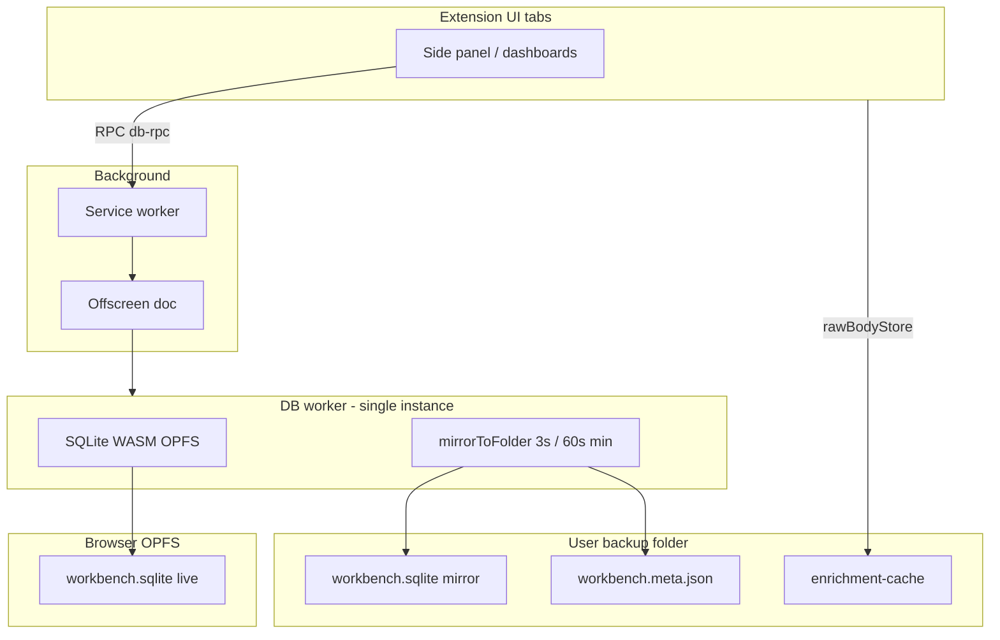

# TASK-V2.1 — SQLite WASM + OPFS (local storage layer)

**Status:** **shipped** (V2.1 schema + folder bridge; **V2.1.1** OPFS worker — dogfood OK 2026-05-29)  
**Last updated:** 2026-05-29  
**Parent:** [`TASK-POST-V2.md`](TASK-POST-V2.md) · Umbrella: [`TASK-POST-V2-D35-storage-backup.md`](TASK-POST-V2-D35-storage-backup.md)  
**Depends on:** V2 closed ([`TASK-V2-CLOSE.md`](TASK-V2-CLOSE.md))  
**Tracker:** V2.1 · D-35 (local storage)

---

## Master direction (locked 2026-05-29)

| Decision | Choice |
|----------|--------|
| **Runtime DB** | **SQLite WASM** with **OPFS** in a **single DB worker** (offscreen doc) — one connection per extension |
| **Existing IDB data** | **Not required to preserve** — fresh empty DB is OK; optional **import from JSON backup** |
| **Fetch raw dumps** | **Unchanged** — `enrichment-cache/{itemId}.md` on disk under user backup folder ([`rawBodyStore.ts`](../../src/lib/enrichment/rawBodyStore.ts)) |
| **Writes** | **Transactional** — one SQLite transaction per logical mutation; no partial multi-store writes |
| **Portable backup** | **`.sqlite` in user folder** (live + manual) **and** **JSON export/import** (same shape as today’s `exportDB` / `importDB`) |
| **Cloud / sharing** | **Out of scope** — design schema + revision fields so V2.2+ can add sync later |
| **IndexedDB** | **Remove as app source of truth** after cutover (IDB may remain only for `FileSystemDirectoryHandle` meta if needed) |

**Goal:** A **performant, clean, reliable, safe** relational model — not a JSON blob reimplemented inside SQL.

---

## What stays the same

| Asset | Location | V2.1 |
|-------|----------|------|
| Raw fetch bodies | `{backupFolder}/enrichment-cache/*.md` | **No change** — `rawRef` on `item_enrichment` still points here |
| Backup folder picker | Settings + `getBackupDirectoryHandle()` | **Keep** — sqlite file lives **in this folder** |
| JSON backup format | `exportDB()` object keys | **Keep as interchange** — import populates SQLite; export serializes from SQLite |
| Envelope metadata | `backupEnvelope.ts` revision / deviceId | **Keep for JSON**; add parallel meta for `.sqlite` in spike |

---

## Backup folder layout (target)

```text
{user-chosen-backup-folder}/
  workbench.sqlite              # debounced mirror of OPFS (not multi-writer sync target)
  workbench.meta.json           # revision + deviceId sidecar
  manual-2026-05-29_143022.sqlite
  manual-2026-05-29_143022.json
  latest.json                   # legacy read for migration only
  latest.sqlite                 # legacy read for migration only
  enrichment-cache/             # UNCHANGED
    {itemId}.md
    {itemId}.review-pending.md
```

**V4 (planned):** per-device subfolders under sync root — see [`TASK-V4-sync-replicas.md`](TASK-V4-sync-replicas.md). **V2.2** = storage polish — [`TASK-V2.2-storage-polish.md`](TASK-V2.2-storage-polish.md).

**Principle:** User picks **one folder** on each machine; DB file is portable backup. Dropbox/rsync deltas work on **sqlite pages**, not 50MB JSON rewrites. **Do not** treat one shared file as multi-device live DB.

---

## Architecture (shipped — V2.1.1)



**Truth model (single device):**

| Phase | Direction |
|-------|-----------|
| Normal use | OPFS = live truth → debounced mirror → folder |
| Startup / empty OPFS | folder → bootstrap → OPFS |
| Conflict “Load remote” | folder → `forceImportFromFolderBytes` → OPFS |
| Uninstall | OPFS gone; folder replica is recovery |

### Layers (implement in this order)

| Layer | Responsibility |
|-------|----------------|
| **`schema.sql` + migrations** | Tables, indexes, `PRAGMA user_version`, FK where safe |
| **`SqliteConnection`** | Open OPFS DB, WAL, busy timeout, single-writer discipline |
| **`SqliteStore` / repositories** | Typed CRUD per aggregate (items, enrichment, …) |
| **`db.ts` facade** | **Same public API** as today (`getItem`, `updateItem`, `exportDB`, `importDB`, …) — swap implementation |
| **`backupCoordinator`** | Debounced **`workbench.sqlite`** mirror + **`workbench.meta.json`**; legacy `latest.*` read-only |
| **JSON bridge** | `exportToJson()` / `importFromJson()` using existing `verifyBackup` |

---

## Schema (first cut — normalize, don’t blob the world)

Map current IDB stores ([`db.ts`](../../src/lib/db.ts) `TabManagerDB`, version 9):

| IDB store | SQL approach | Notes |
|-----------|--------------|-------|
| `projects` | `projects` table | PK `id` |
| `collections` | `collections` + `collection_projects` junction | `projectIds[]` → normalized |
| `items` | `items` table | `placements` JSON column OK; index `url`, `deleted_at`, `updated_at` |
| `notes` | `notes` table | `linked_item_ids` JSON or junction |
| `workspaces` | `workspaces` + `workspace_windows` + `workspace_tabs` | Or JSON `windows` column if spike prefers speed |
| `snapshots` | `snapshots` table | Low volume |
| `item_enrichment` | `item_enrichment` | PK `item_id`; **no** raw body inline — `raw_ref` string only |
| `ai_categories` | `ai_categories` | `centroid` BLOB; index `parent_id`, `status`, `kind` |
| `ai_item_category_links` | `ai_item_category_links` | Indexes `item_id`, `category_id`, `status` |
| `ai_item_signals` | `ai_item_signals` | `embedding` BLOB; index `classify_state`, `discover_state` |
| `ai_taxonomy_state` | `ai_taxonomy_state` | Singleton row `id = 'default'` |
| `trash_history` | `trash_history` | PK `item_id` or composite |

**Meta tables (V2.1):**

| Table | Purpose |
|-------|---------|
| `app_meta` | `schema_version`, `created_at`, optional `device_id` |
| `sync_meta` | `local_revision`, `last_exported_at` — for backup conflict envelope |

**Design rules:**

- Use **INTEGER** timestamps (ms UTC), **TEXT** ids (UUID/slug as today).
- **Foreign keys** ON for link tables; `ON DELETE CASCADE` where product expects it (spike + test).
- **Indexes** for hub/search hot paths: `items(deleted_at)`, `item_enrichment(status)`, `ai_item_signals(classify_state)`.
- **Embeddings:** BLOB (`Float32Array` bytes) — avoid JSON array storage.
- **Future sync:** leave nullable `row_version` / `updated_at` on mutable tables; no sync protocol in V2.1.

Ship `docs/temp/sqlite-schema-v1.sql` (or `src/lib/storage/schema/v1.sql`) in repo.

---

## Migration strategy (simplified per master)

| Path | When |
|------|------|
| **A — Fresh start (default)** | First run after V2.1: create empty SQLite, seed default project/collection, **ignore IDB** |
| **B — Import JSON** | Settings → Import backup: `importDB` JSON → **single transaction** replace all tables |
| **C — IDB one-time (optional)** | Only if trivial: read IDB once → insert — **not required** for acceptance |

**Do not** block the epic on IDB→SQL data fidelity. Master accepts wipe.

**Dev reset:** Document “Clear site data” + delete backup folder sqlite files; re-import JSON if needed.

---

## Atomic updates

| Rule | Implementation |
|------|----------------|
| One user action → one transaction | `BEGIN` … mutations … `COMMIT`; `ROLLBACK` on error |
| Batch import | Entire `importFromJson` in one transaction |
| Pipeline batch | Classify/enrich batches use transactions per chunk (e.g. 50 rows), not per-row autocommit |
| `notifyDataChanged` | Fire **after** successful commit |
| Read consistency | WAL mode; readers don't see half-written state |

Replace ad-hoc multi-`put` IDB patterns with explicit `withTransaction(async (tx) => { … })`.

---

## JSON export / import (required)

**Export (`exportDB`):**

1. `SELECT` all tables (or repository getters).
2. Build **same JSON object** as today (`projects`, `items`, `item_enrichment`, …, `_pipelineExportCounts`).
3. Wrap in **backup envelope** when writing `latest.json` (keep backward compat).

**Import (`importDB`):**

1. `parseBackupText` / `verifyBackup` (unchanged).
2. `DELETE` or `DROP` + recreate tables OR delete all rows — then bulk insert in **one transaction**.
3. Rebuild indexes; `notifyDataChanged('import.replace')`.

**Round-trip acceptance:** export → import → counts match for all entity types.

**Optional:** Settings toggle “Backup format: SQLite / JSON / Both” — minimum is **both code paths exist**.

---

## SQLite file + OPFS + folder sync

| Question | Target answer (decide in spike, document in return) |
|----------|-----------------------------------------------------|
| Primary runtime file | OPFS `workbench.sqlite` **or** write-through to folder handle |
| Live sync copy | Debounced copy to `{folder}/latest.sqlite` via SQLite **backup API** |
| Conflict detection | File size + hash + `sync_meta.local_revision` vs sidecar `latest.sqlite.meta.json` or envelope header |
| Extension reload | OPFS persists; reconnect same path |
| MV3 CSP | Confirm chosen WASM build loads in extension pages + service worker if needed |

**Libraries to spike (pick one, document why):**

- [`@sqlite.org/sqlite-wasm`](https://sqlite.org/wasm) + OPFS VFS  
- `wa-sqlite` + AccessHandle pool VFS  
- `sqlocal` (ergonomics; verify MV3 + OPFS)

---

## `db.ts` cutover plan

| Phase | Work |
|-------|------|
| **1** | Schema + connection + `withTransaction` |
| **2** | Implement repositories; unit-test CRUD on empty DB |
| **3** | Wire **read paths** first (`getAllItems`, enrichment getters, categorization reads) |
| **4** | Wire **write paths** + `notifyDataChanged` |
| **5** | `exportDB` / `importDB` / `verifyBackup` on SQL |
| **6** | `BackupCoordinator` → `latest.sqlite` (+ keep JSON export optional) |
| **7** | Remove IDB open for app data (gate with `STORAGE_BACKEND=sqlite` during dev if useful) |
| **8** | Regression pass (below) |

**Public API:** Minimize churn — callers keep importing from `../lib/db`. Internal implementation only.

---

## Out of scope (V2.1)

- Turso / libsql / hosted sync
- Live multi-writer merge / CRDT
- Dropbox OAuth (manual folder copy still OK)
- Changing raw fetch cache layout
- D-45 folder library
- Pipeline hub UX fixes
- Incremental delta JSON export (full export OK for V2.1)

---

## Regression checklist (dogfood)

- [x] Fresh install: default project, save bookmark, reload extension — data persists (`JsStorageDb` / localStorage)
- [x] Side panel save → dashboard shows bookmark; digest completes (after cross-tab + txn fixes)
- [ ] Import full `latest.json` from old backup — counts + one item open in Inspector
- [ ] Export JSON → re-import — round-trip counts (code path exists; formal count check pending)
- [ ] Export / copy `latest.sqlite` → import sqlite — round-trip counts (**export only**; `.sqlite` import not implemented)
- [ ] Enrich one URL — `enrichment-cache/{id}.md` created; `raw_ref` correct
- [ ] Classify + search + Home batch (smoke)
- [ ] Pin / fav / trash
- [ ] Import Studio commit (small file)
- [x] `npm run build` passes
- [x] Remove/reinstall extension — data present (localStorage and/or backup-folder bootstrap)

---

## Files (expected touch)

| Area | Files |
|------|-------|
| New | `src/lib/storage/sqlite/` — connection, schema, migrations, repositories |
| New | `src/lib/storage/schema/v1.sql` |
| Core | `src/lib/db.ts` — facade to SQLite |
| Backup | `src/lib/backupCoordinator.ts`, `src/lib/backupEnvelope.ts`, Settings backup UI |
| Unchanged | `src/lib/enrichment/rawBodyStore.ts` (verify paths still work) |
| Docs | This file, [`DATA_BACKUP_AND_INTEGRITY.md`](../DATA_BACKUP_AND_INTEGRITY.md) § V2.1 |

---

## Acceptance (V2.1 done)

- [x] App runs on **SQLite WASM** (no IDB for domain data). **Runtime:** OPFS in single DB worker; mandatory backup folder.
- [x] Fresh start works; legacy `latest.json` import on folder pick + `importDB` works
- [x] **`workbench.sqlite`** written to user backup folder on change (debounced); no constant full JSON backup
- [x] Manual backup writes **`manual-*.sqlite`** + **`manual-*.json`** on demand
- [x] JSON export/import still works (`exportDB` / `importDB`)
- [x] Fetch raw dumps still on disk under `enrichment-cache/` (unchanged)
- [x] Writes are transactional; nested `importDB` savepoint support added
- [x] Schema + migration version documented; V2.2 sync hooks in schema comments
- [x] Task return filled (below)

**Follow-ups:** → **V2.2** ([`TASK-V2.2-storage-polish.md`](TASK-V2.2-storage-polish.md)). Multi-device → **V4**. Pipeline → **V3**.

---

## Worker prompt — ~~bootstrap~~ (superseded)

**Shipped.** For follow-ups see **V2.1.1** ([`TASK-V2.1.1-opfs-db-worker.md`](TASK-V2.1.1-opfs-db-worker.md)) and **Acceptance → Follow-ups**.

---

## Task return (worker fills in)

| Field | Value |
|-------|-------|
| **Library chosen** | `@sqlite.org/sqlite-wasm` v3.53.0-build1 — official SQLite WASM build |
| **Runtime path** | **OPFS** in DB worker (`connectionOpfs.ts`). **Bootstrap:** folder `workbench.sqlite` → OPFS when empty. **Mirror:** OPFS → folder (3s debounce, 60s min interval). |
| **Backup path** | **`workbench.sqlite`** + **`workbench.meta.json`** via worker `mirrorToFolder.ts`. Manual: `manual-*.sqlite` + `manual-*.json`. Legacy `latest.*` read-only for migration. |
| **Schema version** | `PRAGMA user_version = 1` — `src/lib/storage/schema/v1.sql` |
| **JSON compat** | Y — `exportDB()` / `importDB()` / `verifyBackup()` same shape as IDB era |
| **IDB removed?** | Y for domain data. `metaDb.ts` IDB only for `FileSystemDirectoryHandle` + revision kv |
| **Files touched** | `src/lib/db.ts`, `src/lib/storage/sqlite/*`, `src/lib/db-idb-backup.ts`, `backupFolder.ts`, `backupSinks.ts`, `trashHistory.ts`, `App.tsx`, `fetchService.ts`, `singleLinkDigest.ts`, `public/manifest.json`, `vite.config.ts`, `package.json` |
| **Rollback** | Swap `db.ts` ↔ `db-idb-backup.ts` |
| **Dogfood (2026-05-29)** | OPFS worker + folder mirror; delete folder sqlite → edit → file restored; reload/reinstall via folder bootstrap. |
| **Known limits** | OPFS requires build+`dist/` (COOP/COEP). Uninstall without folder loses data. Multi-device: need V2.2 per-device replicas — do not share one live sqlite. `.sqlite` import UI pending. Mirror: no tmp+replace yet. |
| **V2.2 hooks** | `app_meta`, `sync_meta`, `updated_at` on mutable tables |

---

## Related

- [`TASK-POST-V2.md`](TASK-POST-V2.md) — active queue  
- [`DATA_BACKUP_AND_INTEGRITY.md`](../DATA_BACKUP_AND_INTEGRITY.md) — update after ship  
- [`TASK-V2-pipeline-hub.md`](TASK-V2-pipeline-hub.md) — active V3 product (storage prerequisite met)  
