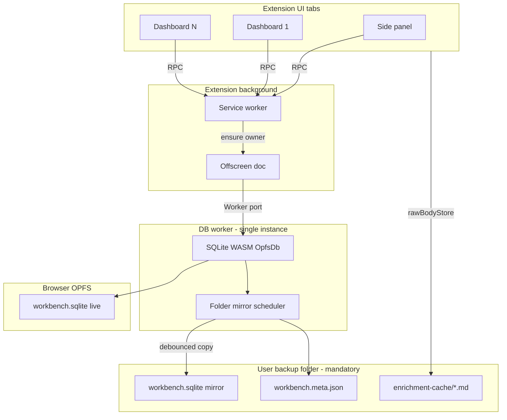

# TASK-V2.1.1 — OPFS DB worker + folder mirror

**Status:** **shipped** — dogfood OK 2026-05-29 (mirror-on-edit, folder bootstrap, multi-tab RPC)  
**Last updated:** 2026-05-29  
**Parent:** [`TASK-V2.1-sqlite-wasm-storage.md`](TASK-V2.1-sqlite-wasm-storage.md) · [`TASK-POST-V2.md`](TASK-POST-V2.md)  
**Depends on:** V2.1 shipped (mandatory backup folder, `workbench.sqlite`, schema v1)  
**Blocks:** Large-library dogfood, multi-tab safety, pipeline batch + UI concurrent use

---

## Why V2.1.1 (problems with current ship)

V2.1 got us **SQL schema + user-visible `workbench.sqlite`**, but runtime still:

| Issue | Cause today |
|-------|-------------|
| **RAM × tabs** | Each side panel / dashboard **deserializes full DB** in its own tab |
| **Multi-tab corruption risk** | Each tab can **flush/export** to the same folder file |
| **Full file rewrite on save** | `sqlite3_js_db_export` → overwrite `workbench.sqlite` (~800ms debounce) |
| **Debounce not global** | `folderPersistence.ts` runs **per tab** |
| **Crash / close window** | No guaranteed flush; non-atomic folder overwrite |

**Goal:** One database process for the whole extension; **OPFS = live truth**; **user folder = debounced mirror**.

---

## Master direction (locked 2026-05-29)

| Decision | Choice |
|----------|--------|
| **Live runtime DB** | **SQLite WASM on OPFS** — single connection in a **dedicated Worker** |
| **DB owner** | **Offscreen document** (`reason: 'WORKERS'`) + Worker — **not** service worker, **not** per-tab |
| **User backup folder** | **Still mandatory** — mirror target + `enrichment-cache/` + manual snapshots |
| **Folder `workbench.sqlite`** | **Downstream mirror** of OPFS (not live deserialize per tab) |
| **Mirror policy** | Debounce **3s** after last mutation + **min interval 60s** + **Sync now** override + flush on owner shutdown |
| **Tabs** | **Thin clients** — RPC to worker; **no** local SQLite, **no** `reloadDB()` deserialize |
| **JSON export/import** | **Keep** — implemented in worker (`exportDB` / `importDB` / `verifyBackup`) |
| **Manual snapshots** | **Keep** — `manual-*.sqlite` + `manual-*.json` on demand only |
| **Cloud sync** | **Out of scope** (V2.2+) |

**Product rule:** *Live data lives in OPFS inside the extension. The folder file updates on a debounced schedule, not on every SQL page write.*

---

## Target architecture



### Write path

1. Tab calls `dbClient.updateItem(...)` → message to service worker → forwarded to DB worker  
2. Worker runs SQL transaction → **commits to OPFS** (WAL / page writes)  
3. Worker bumps `revisionTracker` → schedules **folder mirror** (debounced)  
4. Worker broadcasts `{ revision }` → tabs refresh UI via RPC (not full DB reload)

### Folder mirror path (worker-only)

```
onMutationCommitted:
  scheduleMirror(debounceMs: 3000)

onMirrorFire:
  if now - lastMirrorAt < minIntervalMs: reschedule
  if revision unchanged since last mirror: skip
  checkpoint/export OPFS → write workbench.sqlite.tmp → rename
  write workbench.meta.json (revision, deviceId)
```

| Knob | Default | Override |
|------|---------|----------|
| Debounce | 3s after last commit | Settings later |
| Min interval | 60s | Cap churn during long batch jobs |
| Manual | — | Settings **Sync to folder now** |
| Shutdown | Immediate mirror attempt | Offscreen doc closing / last tab policy |

---

## Phases (implement in order)

### Phase 0 — Spike — **done**

- [x] Offscreen doc + dedicated Worker starts from service worker  
- [x] `@sqlite.org/sqlite-wasm` **OpfsDb** (SAH pool VFS) opens in Worker  
- [x] RPC via `db-rpc` messages (`ping`, `storeInvoke`, …)  
- [x] Copy OPFS bytes → user folder `workbench.sqlite`  
- [x] Second tab: same RPC / hydrated cache **without** local SQLite  

---

### Phase 1 — DB owner shell — **done**

- [x] `manifest.json`: `offscreen` permission + COOP/COEP for OPFS  
- [x] Service worker routes `db-rpc` → offscreen → worker  
- [x] Message protocol: `{ id, method, args }` → `{ id, ok, result | error }`  
- [x] Health: `ping`, `getStatus` (revision, lastMirrorAt)

---

### Phase 2 — Move SQLite into worker — **done**

- [x] `connectionOpfs.ts` worker-only; schema init, transactions  
- [x] Tabs use `RemoteIdbCompatStore` + RPC — no per-tab deserialize/export flush  
- [x] `mirrorToFolder.ts` in worker — sole scheduler for folder `workbench.sqlite`  
- [x] Live JSON backup disabled in `App.tsx`; manual snapshots unchanged  

**Still in tabs / meta:**

- `metaDb.ts` — folder handle + revision kv  
- `rawBodyStore.ts` — `enrichment-cache/` in user folder  

---

### Phase 3 — `db.ts` client facade — **done**

- [x] `db.ts` → `dbClient` RPC; public API preserved  
- [x] `RemoteIdbCompatStore` with IDB-style `transaction()` shim for pipeline code  
- [x] `reloadFromFolderDatabase()` → `forceImportFromFolderBytes` + cache hydrate  

---

### Phase 4 — Bootstrap & folder handoff — **done**

- [x] Mandatory folder pick  
- [x] Offscreen `bootstrapFromFolderIfNeeded()` when OPFS empty + folder has bytes  
- [x] Startup conflict: remote newer → `loadFromRemote()` (not stale local over newer folder)  
- [x] Legacy `latest.json` / `latest.sqlite` read for migration only  

---

### Phase 5 — UI & backup integration — **partial**

- [x] `mirrorNow(true)` on folder pick, conflict resolution, keep-local  
- [ ] Settings: dedicated **Sync to folder now** button (RPC exists; UI pending)  
- [ ] Footer: mirror pending / last synced status (RPC `getStatus` exists; UI pending)  
- [x] Manual backup → `manual-*.sqlite` + JSON  
- [x] `backupCoordinator` reads `workbench.meta.json`  

---

### Phase 6 — Cleanup & docs — **done**

- [x] Mirror scheduled after worker mutating `storeInvoke` / import / bulk import  
- [x] `purgeLegacyLocalDomainStorage()` on bootstrap  
- [x] Docs updated (this file, V2.1, `DATA_BACKUP_AND_INTEGRITY.md`, V2.2 planning)  

---

## RPC surface (MVP)

Start with **coarse methods** mirroring today’s store; optimize later.

**Core**

- `ping`
- `getStatus`
- `mirrorNow({ force?: boolean })`

**Reads (initial — match current UI needs)**

- `getAllProjects`, `getAllCollections`, `getAllWorkspaces`, `getAllItems`
- `getItem`, `getEnrichment`, … (add as needed during port)

**Writes**

- `withTransaction` wrapper internal to worker; expose existing `db.ts` operations:
  - `addItemWithMerge`, `updateItem`, `importDB`, `moveItemToTrash`, …

**Events (worker → tabs)**

- `dataChanged` `{ revision, reason }` — replaces BroadcastChannel + reloadDB

---

## File plan

| Area | New / changed |
|------|----------------|
| `public/manifest.json` | `offscreen` permission |
| `public/offscreen.html` + entry | Offscreen bootstrap |
| `public/service-worker.js` | `ensureDbOwner`, port routing |
| `src/lib/storage/dbWorker/` | `worker.ts`, `connectionOpfs.ts`, `mirrorToFolder.ts`, `protocol.ts` |
| `src/lib/storage/dbClient.ts` | Tab-side RPC wrapper |
| `src/lib/db.ts` | Delegate to `dbClient` |
| `src/lib/storage/sqlite/connection.ts` | Move to worker or split worker/main |
| `src/lib/storage/sqlite/folderPersistence.ts` | **Replace** with worker mirror module |
| `src/App.tsx` | Remove per-tab persistence / reloadDB |
| `src/lib/backupCoordinator.ts` | Mirror status + conflict against meta sidecar |

---

## Acceptance (V2.1.1 done)

### Single process

- [x] Side panel + dashboard share one worker OPFS DB via RPC  
- [x] Tab-side read cache (`RemoteIdbCompatStore`); writes go to worker  

### Safety

- [x] Mutations serialized in worker; `transaction()` shim on remote store for pipeline  
- [ ] Folder mirror **tmp + replace** — direct overwrite today (follow-up)  
- [x] Delete folder `workbench.sqlite` → edit → file recreated from OPFS (dogfood 2026-05-29)  

### Folder

- [x] Mandatory folder at onboarding  
- [x] After edits → mirror scheduled (3s debounce; 60s min interval between writes)  
- [x] `mirrorNow(true)` on folder pick / conflict / keep-local  
- [x] Uninstall loses OPFS; reinstall + same folder restores via bootstrap  

### Compatibility

- [x] Existing folder `workbench.sqlite` bootstraps OPFS when empty  
- [x] JSON import/export + manual backup unchanged  
- [x] `enrichment-cache/` unchanged  

### Removed / reduced

- [x] No per-tab `sqlite3_deserialize` / hot-path folder flush  
- [x] Live JSON backup disabled; folder mirror is worker-only  

---

## Out of scope (V2.1.1)

- Paginated `getAllItems` / search-optimized RPC (follow-up)  
- Turso / cloud sync  
- Direct FSA VFS (OPFS live + folder mirror is enough for this task)  
- Import `.sqlite` file from UI (separate task)  

---

## Risks & mitigations

| Risk | Mitigation |
|------|------------|
| Offscreen doc killed when idle | Reference count open UI ports; wake on RPC |
| Worker can't read folder handle | Handoff at pick time via structured clone to worker; persist handle in metaDb |
| Large DB mirror slow | Min interval + skip unchanged revision; show pending in UI |
| OPFS cleared on “clear site data” | Folder mirror is recovery path; startup bootstrap from folder |
| RPC latency on huge `getAllItems` | Accept for MVP; paginate in V2.1.2 |

---

## Worker prompt (copy-paste)

> Implement **TASK-V2.1.1** per `docs/temp/TASK-V2.1.1-opfs-db-worker.md`.  
>  
> **Spike first:** Offscreen doc + Worker + OpfsDb + RPC ping + one mirror write to mandatory backup folder.  
>  
> **Then:** Move all SQLite into worker; `db.ts` becomes RPC client (keep public API). **OPFS = live DB.** Folder `workbench.sqlite` = debounced mirror only (3s debounce, 60s min interval, manual sync, tmp+replace). **One mirror scheduler in worker** — not per tab.  
>  
> **Keep:** mandatory folder pick, `enrichment-cache/`, JSON export/import, manual snapshots, `workbench.meta.json`.  
>  
> **Remove:** per-tab deserialize/export flush, tab `reloadDB()` on BroadcastChannel.  
>  
> Fill **Task return** when done.

---

## Task return (worker fills in)

| Field | Value |
|-------|-------|
| **Offscreen + worker** | `src/offscreen/offscreen.ts` + `src/lib/storage/dbWorker/worker.ts`; SW routes `target: 'db-rpc'` |
| **OPFS path** | `connectionOpfs.ts` — SAH pool VFS (`installOpfsSAHPoolVfs`), fallback in-memory if COOP/COEP missing |
| **Mirror policy shipped** | 3s debounce, 60s min interval, `mirrorNow({ force })`; revision reload from meta kv before write |
| **Folder handle handoff** | Tabs/offscreen read handle via `metaDb` + `backupFolder.ts`; offscreen writes mirror bytes |
| **RPC methods ported** | `ping`, `getStatus`, `mirrorNow`, `hydrate`, `storeInvoke`, `bootstrapFromFolderBytes`, `forceImportFromFolderBytes`, `exportSqliteBytes`, `importDB`, `bulkImportBookmarks` |
| **Dogfood (2026-05-29)** | Edit → `workbench.sqlite` reappears in folder after delete; persists reload; conflict load-remote fixed |
| **Known limits** | No tmp+replace on mirror; Settings mirror status UI pending; build+load `dist/` for OPFS (not dev alone) |
| **Files touched** | `dbWorker/*`, `dbClient/*`, `connectionOpfs.ts`, `offscreen.ts`, `App.tsx`, `db.ts`, `manifest.json`, `vite.config.ts` |

---

## Related

- [`TASK-V2.1-sqlite-wasm-storage.md`](TASK-V2.1-sqlite-wasm-storage.md) — shipped bridge  
- [`DATA_BACKUP_AND_INTEGRITY.md`](../DATA_BACKUP_AND_INTEGRITY.md)  
- [`TASK-POST-V2-D35-storage-backup.md`](TASK-POST-V2-D35-storage-backup.md)  
- [Chrome: SQLite Wasm + OPFS](https://developer.chrome.com/blog/sqlite-wasm-in-the-browser-backed-by-the-origin-private-file-system)  
- [Extensions: offscreen WORKERS reason](https://developer.chrome.com/docs/extensions/reference/api/offscreen)
