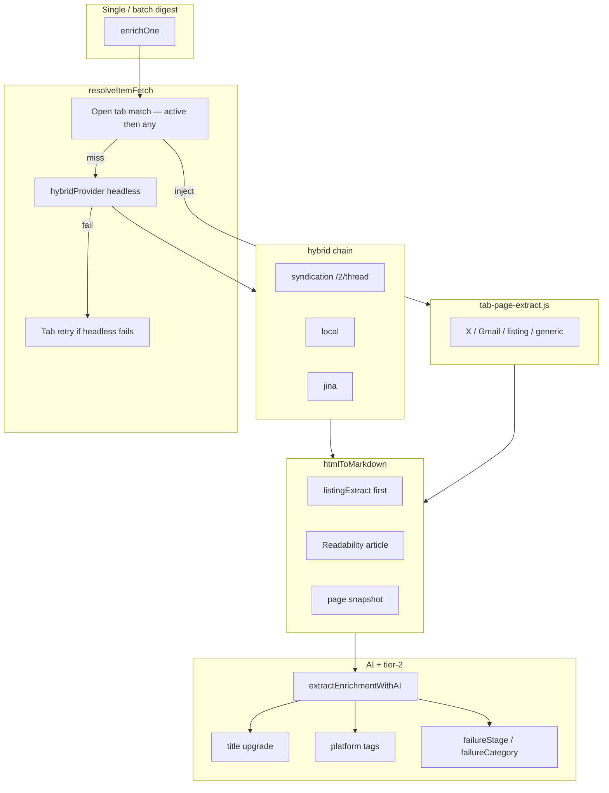

# TASK-V2C-D10 — Fetch improvement (umbrella)

**Status:** **closed** (2026-05-28) — headless + tab session + session extras shipped  
**Parent:** V2 bucket **#1 Backend pipeline** + part of **#2 Pipeline workflow**  
**Tracker:** [V2-DEFERRED-TRACKER.md](V2-DEFERRED-TRACKER.md) **D-10** (D-10.1 … D-10.6)  
**Depends on:** Task 01 closed  
**Blocks:** D-25 review UI (after D10.5 formally closed)

**Findings report (master):** [`D10-FETCH-FINDINGS-REPORT.md`](D10-FETCH-FINDINGS-REPORT.md) — mechanical + LLM judge on 500 URLs; reuse for all D10 decisions.

---

## Program return (2026-05-28)

### Subtask queue

| ID | Brief | Status | Result |
|----|-------|--------|--------|
| **D10.1** | [`TASK-V2C-D10.1-baseline-experiment.md`](TASK-V2C-D10.1-baseline-experiment.md) | ✅ done | 500-URL corpus + mechanical stats |
| **D10.2** | [`TASK-V2C-D10.2-fetch-judge.md`](TASK-V2C-D10.2-fetch-judge.md) | ✅ done | 62.4% judge-ok; 92 FP catalog |
| **D10.4 slice 1** | [`TASK-V2C-D10.4-headless-proven-fixes.md`](TASK-V2C-D10.4-headless-proven-fixes.md) | ✅ done | Quality gates, t.co unroll, Reddit fail-fast → **63.0%** judge-ok |
| **D10.6 core** | [`TASK-V2C-D10.6-recursive-follow.md`](TASK-V2C-D10.6-recursive-follow.md) | ✅ done | FxTwitter `/2/thread` → **69.0%** judge-ok; thin_content 24→9 |
| **D10.3** | [`TASK-V2C-D10.3-tab-profile-auth-cli.md`](TASK-V2C-D10.3-tab-profile-auth-cli.md) | ✅ eval done | Playwright tab rescue **2/22** (9%) — weak; real Chrome tab is the product path |
| **D10.5** | [`TASK-V2C-D10.5-extension-tab-fetch.md`](TASK-V2C-D10.5-extension-tab-fetch.md) | ✅ done | Tab session + ephemeral tab + Inspector **Fetch in browser** |
| **D10.4b** | same brief | ⬜ later | GitHub blobs, pick-best, Reddit scratch alts |
| **D10.6b** | same brief | ✅ done | Link follow (case C) in `xLinkFollow`; quote in thread API |

### Headless benchmark arc (500 URLs, `--no-tab`)

| Stage | Judge ok | Notes |
|-------|----------|-------|
| D10.2 baseline | **62.4%** (312/500) | 92 regex false positives |
| D10.4 slice 1 | **63.0%** (315/500) | t.co +21; Reddit fail-fast |
| D10.6 X threads | **69.0%** (345/500) | X judge-ok 138→150; syndication best 4→69 |

Tab-session wins (Reddit logged-in, Gmail, private pages) are **real in the app** but **not re-measured** on the 500-URL CLI corpus.

### Session extras (product pipeline — not in original D10 briefs)

Shipped alongside D10.5 work; improves digest quality for all fetch modes:

| Extra | Problem | Solution | Key files |
|-------|---------|----------|-----------|
| **Listing / portal extract** | Subreddit feeds, forum indexes, category pages summarized as one Readability article | Listing-first pipeline before Readability; generic AI listing prompts | `listingExtract.ts`, `htmlExtract.ts`, `public/tab-page-extract.js`, CLI `listingExtract.mjs` |
| **URL fidelity** | Dedup normalization overwrote saved URLs; Gmail hash URLs lost | `normalizeBookmarkUrl()` = dedup key only; `item.url` = exact saved URL; `resolveTabBookmarkUrl()` for live tab href | `db.ts`, `tabUrlCapture.ts` |
| **AI title upgrade** | Weak titles (`Untitled`, `r/foo`, site suffix junk) kept after digest | `shouldUpgradeBookmarkTitle()` + expanded `titleLooksWeak()`; prompt nudge when weak | `eligibility.ts`, `fetchService.ts`, `aiExtract.ts`, `prompts.ts` |
| **Platform auto-tags** | No consistent host tags for filter/search | `platformHintFromUrl()` → `x`, `reddit`, `youtube`, etc. on `item.tags` + `metadata.platform` | `platformTags.ts` |
| **Failure labeling** | Hard to bulk-review failed enrichments | `failureStage` + `failureCategory` persisted on failed rows; optional UI badges/filters | `failureLabels.ts`, `types.ts`, `fetchService.ts` |

**Policy confirmed:** label failures only — **no auto-delete** on failed enrichments.

---

## Wrap-up: remaining to close umbrella

**Formal exit criteria (original):** D10.1–4 CLI gate met + **D10.5 shipped**.

| Gate | Status | To close |
|------|--------|----------|
| D10.1–2 measure + judge | ✅ | — |
| D10.4 slice 1 headless | ✅ | — |
| D10.6 X `/2/thread` | ✅ | — |
| D10.3 tab-profile eval | ✅ (weak rescue documented) | Skip further CLI tab work unless researching Reddit automation |
| **D10.5 Mode B in product** | ✅ | Ephemeral tab + Inspector button (2026-05-28 close) |
| D10.4b / D10.6b | ⬜ optional | Not required for umbrella close if tab session + current headless ceiling accepted |

### D10.5 close checklist — **done** (2026-05-28)

- [x] **Inspector “Fetch in browser”** — skips headless; opens/matches tab + ephemeral
- [x] **Auto-open background tab** — `openEphemeralTabAndExtract` after headless fail (`bot_blocked` / `auth_required` / `file://`)
- [ ] (Optional) Extract `tabSessionProvider` module — deferred; logic in `fetchService.ts` + `tabSessionExtract.ts`
- [x] Manual acceptance: user-validated Reddit/Gmail/local PDF in real Chrome
- [x] D10.5 brief + umbrella marked ✅

### Optional stretch (after umbrella close)

- **D10.4b** — GitHub blob/raw path, pick-best provider, Reddit headless alts
- **D10.6b** — link-in-tweet → article follow (depth 1, max N) — *core link follow shipped in product*
- **Batch digest tab policy** — per-row tab session for auth-heavy hosts in batch runs
- **Re-digest backfill** — titles, platform tags, failure labels on existing library
- **D-25** — suspicious re-fetch review/compare UI (`pendingFetchReview`)
- **D-45** — local folder library (scan PDFs/papers → map + import) — [`TASK-V2C-D45-local-folder-library.md`](TASK-V2C-D45-local-folder-library.md)

### Session return (2026-05-28 — continuation)

**Shipped this session (product):**

| Item | Notes |
|------|--------|
| X eligibility | Never `skipFetch` for X; re-digest after `skipped_sufficient_local` |
| X expand v2 | Quote threads + link follow (PDF/articles) |
| Oversized fetch | Truncate at 150k chars instead of hard fail |
| Side panel title sync | DB title upgrades reflect without tab switch |
| **`file://` bookmarks** | Save/dedup/digest local PDFs & files; tab-first fetch; manifest + “Allow access to file URLs” |

**Deferred to D-45:** bulk **folder scan** → library of local PDFs/papers (not single-tab save).

---

## Subtask queue (reference)

**Evidence-based order (completed):** 1 → 2 → 4 slice 1 → 6 → 3 (eval) → **5 (partial)** → 4b / 6b (optional).

**Rule:** Bot-host **solving** deferred to slice 2; **fail-fast** in slice 1. Extension tab session unblocked after slice 1 — D10.3 eval showed Playwright profile is a poor proxy; **real Chrome tab** is the production auth path.

**Implementation sessions:** update **only the subtask file** you were assigned + code; master syncs this umbrella + tracker.

---

## Documentation rule

**Implementation session:** update **only this file** + code. Master syncs `backlog.md` / tracker after return.

---

## Goal (master — agreed direction)

Improve **fetch** along two **modes** that stay separate in architecture:

| Mode | Where it runs | Auth |
|------|----------------|------|
| **A — Headless / CLI** | Extension `hybridProvider` + `scripts/enrich-fetch/` (Playwright tab optional) | **No** user session — improve chains, bot/login-wall detection, recursive expand |
| **B — User-session** | **Real Chrome tab** in user profile (content script or `scripting.executeScript`) | **Yes** — only path for paywalled / logged-in pages |

**Not in v1 of this task:** D-25 product review UI, full D-26 auto-digest policy, import-time auto-enrich for every row.

---

## Current state (as of 2026-05-28)

### Extension (`src/lib/enrichment/`)

| Piece | Behavior |
|-------|----------|
| `hybridProvider` | X: **syndication `/2/thread` first** → local CDN fallback; video: `jina`; article: `local` → `jina`; Reddit: fail-fast `bot_blocked` |
| `localProvider` | Extension-origin fetch — does **not** use user's site cookie jar |
| `fetchQuality.ts` | Host gates, boilerplate detection, `auth_required`, `bot_blocked`, paywall phrases |
| **Tab session (Mode B)** | `tabSessionExtract.ts` + `public/tab-page-extract.js` — inject on matching open tab **before** headless; retry after headless fail; `fetchSourceId: 'tab-session'` |
| `htmlExtract` / listing | **Listing-first** — `listingExtract.ts` before Readability for portal/feed pages |
| `enrichOne` / `fetchService` | Tab → headless → tab retry; title upgrade; platform tags; failure labels on failed writes |
| Side panel + digest | Auto-resolve open tab (`resolveTabSessionForUrl`, `findTabForUrl`); side panel passes `preferTabSession` + `tabId` on save |

### CLI (`scripts/enrich-fetch/`)

| Piece | Behavior |
|-------|----------|
| `tabBrowser.mjs` | Playwright Chromium; optional `--tab-profile` (D10.3: weak Reddit rescue) |
| `xThread.mjs` | FxTwitter `/2/thread` — parity with extension syndication |
| `listingExtract.mjs` | Listing extract parity with extension |
| Experiments | 500-URL corpus; judge at 69.0% after D10.6 |

### Product gaps (known)

- No open tab → Reddit/auth still fail headless
- Batch digest mostly headless — no systematic tab session per row
- Gmail exact message hash can miss if tab URL ≠ saved hash URL
- Listing heuristics imperfect on heavy JS / infinite scroll without loaded tab
- Legacy failed rows: failure labels derived at read time unless re-digest
- **`file://` PDF text** — tab extract is title/filename-heavy; full PDF parse not shipped (see **D-45**)
- **Local folder import** — single-file bookmark only; bulk scan deferred to **D-45**

---

## Architecture (today)

### Mode A — Headless (shipped)

- **A1.** Failure taxonomy — `auth_required`, `bot_blocked`, `parse_empty`, etc.; failure labels persisted
- **A2.** Slice 1 — t.co unroll, Reddit fail-fast, quality gates ✅; pick-best / GitHub blobs → D10.4b
- **A3.** X `/2/thread` on every X status URL ✅; link follow → D10.6b

### Mode B — User-session (shipped)

**Product answer:** Load URL in **user's Chrome profile tab**, extract DOM via injected script, same AI path.

**Shipped:** B1 (active tab) + **any matching open tab** before headless; **B2 ephemeral background tab** on `bot_blocked` / `auth_required` / `file://`; Inspector **“Fetch in browser”** (`tabSessionOnly`); side panel `preferTabSession` + `tabId`.

**Optional refactor:** dedicated `tabSessionProvider` module (logic lives in `fetchService.ts` + `tabSessionExtract.ts` today).

**Detail:** [`TASK-V2C-D10.5-extension-tab-fetch.md`](TASK-V2C-D10.5-extension-tab-fetch.md)

---

## Phased delivery

Umbrella exit = D10.1–4 CLI gate met + **D10.5 formally closed** (see wrap-up checklist).

### Failure buckets (reference)

| Bucket | Meaning | Subtask |
|--------|---------|---------|
| `auth_required` | Login/paywall HTML | D10.5 tab session (D10.3 CLI weak) |
| `bot_blocked` | Cloudflare, Reddit, etc. | D10.4 fail-fast; tab for logged-in Reddit |
| `parse_empty` | Readability empty | D10.4 / listing extract |
| `rate_limited` | 429 / quota | D10.4 |
| `provider_gap` | All providers fail | D10.4b research |

### Explicitly out of scope (whole D-10 program)

- D-25 review/compare UI
- Full side-panel redesign
- Replacing all batch digest with tab fetch
- Recursive depth > 1
- Reddit “solve” without tab session
- Auto-delete failed enrichments

---

## Key files

| Area | Paths |
|------|--------|
| Orchestrator | `fetchService.ts`, `singleLinkDigest.ts`, `App.tsx` |
| Providers | `providers/hybrid.ts`, `local.ts`, `syndication.ts`, `xThread.ts` |
| Tab session | `tabSessionExtract.ts`, `public/tab-page-extract.js`, `tabUrlCapture.ts` |
| Extract | `htmlExtract.ts`, `listingExtract.ts` |
| Quality | `fetchQuality.ts`, `urlPolicy.ts` |
| AI / tier-2 | `aiExtract.ts`, `prompts.ts`, `eligibility.ts`, `platformTags.ts` |
| Failure labels | `failureLabels.ts`, `types.ts`, `errorMessages.ts` |
| CLI | `scripts/enrich-fetch/lib/xThread.mjs`, `listingExtract.mjs`, `tabBrowser.mjs`, `run-fetch-judge.mjs` |
| Manifest | `public/manifest.json` — `"scripting"` added |
| UI (optional) | `EnrichmentReviewModal.tsx` — failure-type filter chips |

---

## Umbrella completion checklist

- [x] D10.1 baseline return merged into tracker notes
- [x] D10.2 judge
- [x] D10.3 tab-profile metrics (weak rescue documented)
- [x] D10.4 headless slice 1 + deferred list for slice 2
- [x] D10.5 extension tab fetch (ephemeral tab + Inspector + side panel)
- [x] D10.6 X `/2/thread` core
- [x] Session extras documented (listing, URL fidelity, titles, tags, failure labels)

Subtasks own acceptance criteria and task returns.

---

## Master notes (for user — not implementation)

**CLI vs auth split is correct.** Playwright `--tab-profile` is lab-only; extension uses **real Chrome tabs**.

**Auth:** Side panel alone is not magic — you need **tab in user profile + DOM extract**. Side panel triggers it when saving the current page; dashboard re-digest finds **any** matching open tab.

**Recursive follow / X threads:** Author 🧵 = D10.6 case A — **shipped**. Link-in-tweet → article = case C — **D10.6b, not shipped**. Quote tweets already work.

**D-10 closed 2026-05-28.** Optional follow-ups: D10.4b, D-25 review UI, batch tab policy.

**Local folder library (bulk PDFs/papers):** tracked as **D-45** — [`TASK-V2C-D45-local-folder-library.md`](TASK-V2C-D45-local-folder-library.md) · not part of D10 scope (single `file://` only).

*Last updated: 2026-05-28 — umbrella closed; program return authoritative.*
